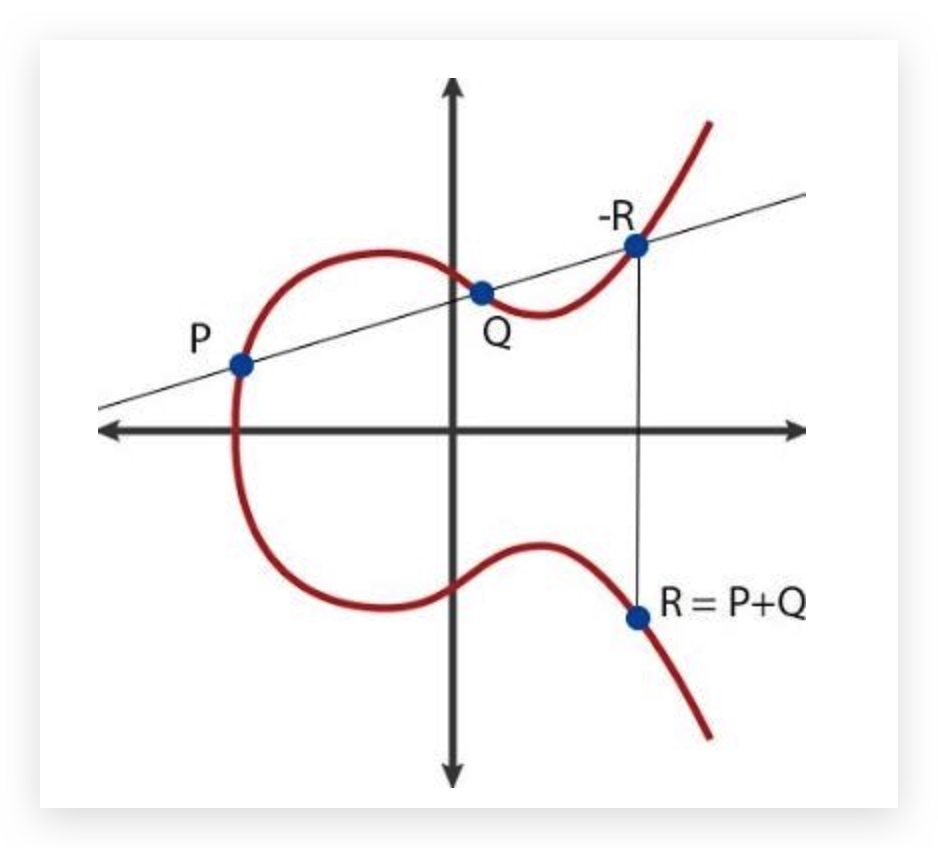

# **Verification & Encryption**
## Verification
When information is tranmitted from the sender to the receiver, the receiver needs a method to check whether the information was changed during the transportation. Then we need to consider if we can recover the change. The same thing happens when information is stored somewhere like a disk, and after a period of time the information may get lost. So the problem is about three things: whether the information is changed, where the changes happened and how can we recover it.  

### Parity 
Odd-even Parity is the simpliest way of parity. Suppose you have a sequence of 1 and 0 to pass from the sender to the receiver. Then the sender can make a convention with the receiver: first, append one additional bit at the end of the sequence. And whether the last bit is 1/0 is dicided by the number of 1 in the sequence so that the number of 1 in the whole sequence should be even. And if the receiver found that there are odd number of 1 in the sequence, it should be affirm that something must be wrong in the trans mission.  

However only one additional bit can only tell the receiver whether the information is damaged, but not where the damage happens. So two-dimensional parity took place, and it can correct single-bit error in a sequence.  
> ### Two-dimensional Parity
>Suppose a single bit was changed in a sequence of *d* digits 1/0 sequence during transmission. To detect the position of the error, we may make a table like this:(suppose *d* = 15)  
>
>1 0 1 0 1 &emsp; 1  
>1 0 1 1 0 &emsp; 0  
>0 1 1 1 0 &emsp; 1  
>  
>0 0 1 0 1 &emsp; 0  
>
>The sender can fold the whole sequence into a 3*5 table, and for each row and column set one parity bit, so that the number of 1 in every row and column should be even. So we get an additional parity row and an additonal parity colomn. From the example shown, we can easily find the 0 at (2,2) should be 1.
This kind of ability to detect and correct errors is called Forward Error Correction(FEC). 

### Checksum
In the checksum verification, the whole *d* bit message is regarded as a sequence of *k* bit integer. Take Internet checksum as an example, the message is divided into 16 bits integer and the sequence of integer will be added together to generate the final checksum.The checksum will be passed together with the original message. After receiving the result, the receiver only needs to do the same operation and check if the sum is the same with the passed checksum. If not, then either the checksum or the message is changed during transmission.  
Checksum is actually a way of hashing the message. However these hashing methods provide a weak protection despite its low cost. Since we can't tell where the error happens and can't recover it.  So in the actual internet, the TCP and UDP use checksum while the link layer protocals use CRC.

### CRC 
**Cyclic Redundancy Check**, or CRC, is a widely used verification technology in computer network. It is also called **polynomial code** since the message to be passed is regarded as the coefficient of a polynomial.  
In this situation: if we gonna pass a message of *d* bits, the sender and the receiver must have a shared polynomial of *r* + 1 bits coefficient. This polynomial is called the **generator** G. The highest bit(the first bit from the left) must be 1.  
For the *d* bits message, the sender must append *r* bits to get *d* + *r* bits binary code. This binary number is exactly divisible by G using mod 2 arithmetic.  
>#### Mod 2 arithmetic
>Mod 2 arithmetic is a kind of special binary operations. It also has addition, subtraction, multiplication and division. However it doesn't consider carry and borrowing when adding and substracting numbers, which means that addition and subtraction are the same here. They are all actually XOR by bit.  
>For example, 1101 + 110 = 1011.  
>When doing multiplication, there's no carrying so 1001 * 1101 = 1100101. What is useful is multiply 2k is actually shifting left for k bits.
>For division, there's more rules:  
>When the residual's digit is less than the divider, the operation stops.
>When the dividend's digit is less than the divider, the quotient equals 0 and the dividend is the residual.  

So the original message M with the appended *r* bits R can be represented by  
D * 2*r* XOR R, which is the multiple of the generator G.  
To calculate the R for a message M to pass, we just need the residual of  
(D * 2*r*)/G.  
IEEE has defined the standard generator G for 8, 12, 16 and 32 bits. Every standard can detect the errors less than *r* continuous bits.

### RAID
Let's dive into a practical example where verification and correction is used in storage. **Redundant Array of Inexpensive Disks** is a technique that allow computer regard a set of disks as a whole. And it allows damages to some extends and provides solutions to recover the damage depends on the RAID level. Different levels of RAID uses different ways of redundancy to provide different capacity, reliabliity and performance.  
#### RAID 0 - striping
#### RAID 1 - mirror
#### RAID 10 - combined
#### RAID 4 - parity
#### RAID 5 - rotated parity

## Encryption
The need of encryption appeared from a long time ago, when people need to tranmit some message secretly. Different encryption methods are widely used in network technologies nowadays. The main encryption technologies are **Symmetric Encryption** and **Asymmetric Encryption**.  
### Symmetric Encryption
Caeser encryption is a typical symmetric encryption method. The sender and the receiver take a number *X* they all know before passing meassages. For every character in the message, the sender change it by the character *X* position after the original one in the alphabet. For instance, if they choose *X* = 2, then all 'a' in the message will be replaced by 'c',and 'b' will be replaced by 'd', and so on. When the receiver get the message, they should replace on the opposite direction, that is replace 'c' by 'a', 'd' by 'b', and so on.
So the sender and the receiver use the same way to encipher and decipher in symmetric encryption.  
However these encryption methods have some problems and are easy to hack. Since the *X* must be decided and known by both sender an receiver, but how should we pass the *X* secretly? And the hacker can easily guess the *X* since the pattern is not complicated.

### Asymmetric Encryption
To explain what 'asymmetric' mean here, let's use the caeser encryption example again. To make an analogy, it's like the sender replaces 'a' by 'c' to encipher, but the receiver uses 'c'by 'b' to decipher. But how does that even possible? Let's dive into 2 actual asymmetric encryption methods: RSA and ECC.  
#### RSA
RSA encryption is named after the name of the 3 inventers. It widely used in Internet(for example SSH protocal).  

##### Encipher and decipher process
First, the sender pick 2 prime number *p* and *q*, for example *p* = 61, *q* = 53. Then calculate *n* = *pq* and ϕ(*n*) = (*p*-1) * (*q*-1), in our example *n* = 3233 and ϕ(*n*) = 3120.  
Second, pick the **public key** (*e*,*n*)   
so that 1< *e* < ϕ(*n*) and gcd(*e*,ϕ(*n*))=1(which means *e* and ϕ(*n*) are relatively prime). In our example, suppose we choose *e* = 17.  
Next, calculate the **private key** (*d*,*n*) using **Extended Euclidean Algorithm**    
*d* should fit the formula: *e* * *d* ≡ 1(mod ϕ(*n*)), in our example we need to get *d* from 17 \* *d* ≡ 1(mod 3120), which is 2753.
Before passing message, both sides should generate their own public key:  
(*e1*,*n*), (*e2*,*n*)  
and private key:  
(*d1*,*n*), (*d2*,*n*).  
Then both sides should exchange their public key and keep their private key secret.  
To encipher message(let's say the number *X* = 65 is to be enciphered), the sender needs to calculate using the receiver's public key *e2*. And X*e2* mod n = *Y* (6517 mod 3233 = 2790) is the final enciphered result.  
To decipher the result *Y*, the receiver need it's own private key *d2*. The deciphered result  
*Z* = *Y**d2* mod *n* = 27902753 mod 3233 = 65 = *X*

##### Mathematical foundation
During the process of generating public key *e* and private key *d*, the concept of **modular inverse**. Specifically, *e* and *d* are the modular inverse about ϕ(*n*) of each other, fitting *e* \* *d* ≡ 1 (mod ϕ(n)).  
From   
*e* \* *d* ≡ 1 (mod ϕ(n))  
we can infer that  
*e* * *d* − 1 = k * ϕ(n)(k is some integer).  
So during encryption, *Y* = *X**e* mod *n* and during decryption  
*Z* = *Y**d* mod *n* = (*X**e* mod *n*)*d* mod *n* = *X**ed* mod *n*.  
Since *e* * *d* − 1 = k * ϕ(n),  
*X**ed* = *X*1+kϕ(*n*) = *X* * (*X*ϕ(*n*))k  
According to Euler's theory, if *X* and *n* are relatively prime,  
*X*ϕ(*n*) ≡ 1 (mod *n*).  
So *X**ed* ≡ *X* * 1k ≡ *X* (mod *n*). Which means   
*Z* = *X**ed* mod *n* =*X* mod *n* = *X*  
(*X* should be guaranteed to be smaller than *n*)   
To hack RSA, the private key *d2* is a must. However, this is nearly impossible(at least now). You either break down *n* into *p* and *q* so that you can get ϕ(*n*), or you have to try all the possible *d2*. The difficulty of breaking big numbers into prime numbers gives RSA algorithm its unbreakable safety.
>##### Euler's theory
>Euler's theory claims that if a and b are 2 integer that are relatively prime(gcd(a,b) = 0), they fit the following fomular:  
aϕ(b) ≡ 1 (mod b)   
(ϕ(b) is a function that equals to the number of positive integers that are smaller than b but are relatively prime with b)  
In RSA algorithm, *n* is the multiplication of 2 prime number *p* and *q*, so only the multiple of *p* and *q* are not prime with *n*. So ϕ(b) = (*p*-1) * (*q*-1)  
>##### Fast Power algorithm
>Calulate powers by simply multiplying is an unefficient way. In RSA, when you need to calculate 27902753, you would certainly want something fast.  
>Simly multplying 2790 by 2753 times need a time complexity of O(n), but fast power algorithm gives you O(log n). The operation is like this:  
>When you get 2790 * 2790, instead of multiply 2790 again, you should square it. Then square it again. So you can get 27908, 279016, 279032... very quickly.  
>However, you can't get 2753 by just the power of 2. So another important operation is to break down the power into the sum of the power of 2.  
>For instance, if we want to calculate *x*11, we can calculate  
>*x*1 * *x*2 * *x*8  
>which are all easy to get. 

#### ECC
ECC, or Elliptic Curve Cryptography, is another asymmetric encryption based on **Elliptic curves**. Don't mess elliptic curve with ellipse. 
Elliptic curves get it's name from the elliptic integral and look no similar like ellipse.
The general representation of elliptic curves is:  
*y*2 = *x*3 + a*x* + b  
(a, b are constants that fits 4a3 + 27b2 ≠ 0 to ensure that it has derivative at any point)  
  
The elliptic curves have a significant property: the points of a elliptic curve form an **Abel Group**  
If we pick 2 points(P, Q) on a elliptic curve and draw a line *L* that goes through these 2 points. Then *L* will certainly met with the curve at a third point S. Suppose the symmetric point of S about the x axis is R, then we define R = P + Q and R = -S.  
If *L* has only 2 intersections P and S with the curve, meaning that P, Q merge at one point and P is actually a point of contact. In this case we define R = -S = 2P. Meanwhile we define the point infinite far away as 0 and the symmetric point of P about x axis as -P.  
For any point P on an elliptic curve,  if kP = 0, define the minimum k as the order of P. If k doesn't exist, define k as infinite. So according to this definition, if k exists, (k-1)P and P are symmetric about x axis.  

Before enciphering, the sender and the receiver use the same curve *E*. The receiver pick one point G as a base. Then the receiver generates a private key *d*, which is a random integer smaller than the order of G(the order of G must be a prime number). Followed with the step of calculating S = *d*G. Finally (*E*, S, G) will be pass to the sender as the public key.  
To encipher a piece of message, the sender first selects a random number *n*(smaller than the order of G) and calculates 2 points *P* = *n*G and *Q* = M + *n*S(*M* is the message to encipher). Then (*P*, *Q*) will be passed.  
To decipher the message, the receiver just need to use its own private key to calculate  
*Q* - *dP* = M + *n*S - *dP* = M + *nd*G - *dn*G = M
If anyone want to hack using *P* and *Q*, figuring out *d* would be the biggest chanllenge since its so difficult to get *d* from S and G.  

I guess it is quite clear how asymmetric encrypto algorithms work. To creat a kind of asymmetric encrypto algorithm, the key step is to find an operation that is easy to perform but with a difficult inverse operation. In RSA, multiplying 2 prime number is easy, but break they from a large number is difficult. In ECC, given k and G, it would be easy to calculate kG, but it is much more difficult to get k from S and G.